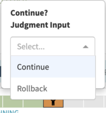
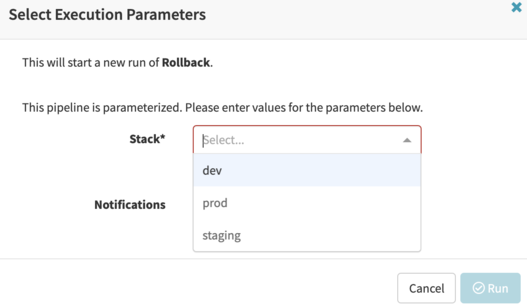
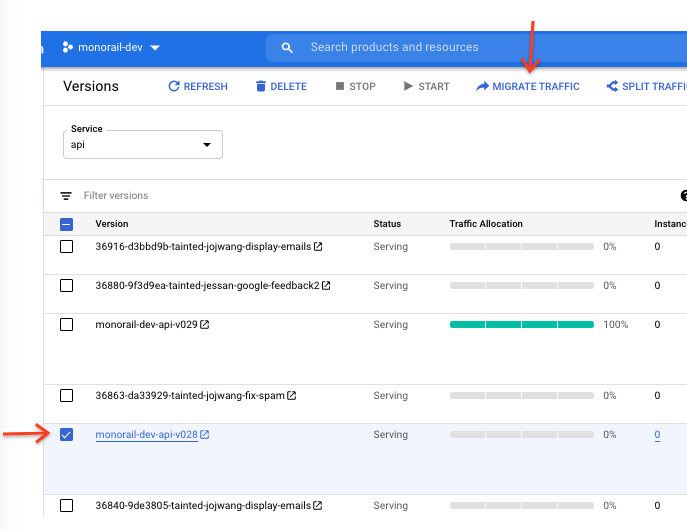

# Monorail Deployment

*This document covers updating Chromium's instance of Monorail through
Spinnaker. If you are looking to deploy your own instance of Monorail,
see: [Creating a new Monorail instance](instance.md)*

## Before your first deployment

Spinnaker is a platform that helps teams configure and manage application
deployment pipelines. We have a
[ChromeOps Spinnaker](http://go/chrome-infra-spinnaker) instance that holds
pipelines for several ChromeOps services, including Monorail.

IMPORTANT: In the event of an unexpected failure in a Spinnaker pipeline, it is
extremely important that the release engineer properly cleans up versions in the
Appengine console (e.g. delete bad versions and manual rollback to previous
version).

### Spinnaker Traffic Splitting

Spinnaker's traffic splitting, rollback, and cleanup systems rely heavily on the
assumption that the currently deployed version always has the highest version
number. During Rollbacks, Spinnaker will migrate traffic back to the second
highest version number and delete the highest version number. So, if the
previous deployed version was v013 and there was a v014 that was created but
somehow never properly deleted, and Spinnaker just created a v015, which it is
now trying to rollback, this means, spinnaker will migrate 100% traffic "back"
to v014, which might be a bad version, and delete v015. The same could happen
for traffic migrations. If a previous, good deployment is v013 with 100%
traffic, and there is a bad deployment at v014 that was never cleaned up, during
a new deployment, Spinnaker will have created v015 and begin traffic splitting
between v014 and v015, which means our users are either being sent to the bad
version or the new version.

If you are ever unsure about how you should handle a manual cleanup and
rollback, ping the [Monorail chat](http://chat/room/AAAACV9ZZ8k) and ask for
help.

Below are brief descriptions of all the pipelines that make up the Monorail
deployment process in Spinnaker.

#### Deploy Monorail

This is the starting point of the Monorail deployment process and should be
manually triggered by the Release Engineer.

This pipeline handles creating a Cloud Build of Monorail. The build can be created from
HEAD of a given branch or it can re-build a previous Cloud Build given a "BUILD_ID".
Once the build is complete, a `Deploy {Dev|Staging|Prod}` pipeline can be automatically
triggered to deploy the build to an environment. On a regular weekly release, we should
use the default "ENV" = dev, provide the release branch, and leave "BUILD_ID" empty.

##### Parameter Options

*   The "BRANCH" parameter takes the name of the release branch that holds
    the commits we want to deploy.
    The input should be in the form of `refs/releases/monorail/[*deployment number*]`.
    e.g. "refs/releases/monorail/1" builds from HEAD of
    [infra/infra/+/refs/releases/monorail/1](https://chromium.googlesource.com/infra/infra/+/refs/releases/monorail/1).
    It will also accept "master" to build from HEAD of the infra
    [master branch](https://chromium.googlesource.com/infra/infra/+/refs/heads/master).
*   The "ENV" parameter can be set to "dev", "staging", or "prod" to
    automatically trigger `Deploy Dev`, `Deploy Staging`, or `Deploy
    Production` (respectively) with a successful finish of `Deploy Monorail`.
    The "nodeploy" option means no new monorail version will get deployed
    to any environment.
*   The "BUILD_ID" parameter can take the id of a previous Cloud Build found
    [here](https://pantheon.corp.google.com/cloud-build/builds?organizationId=433637338589&src=ac&project=chrome-infra-spinnaker).
    We can use this to rebuild older Monorail versions. When the "BUILD_ID"
    is given "BRANCH" is ignored.

#### Deploy Dev

This pipeline handles deploying a new monorail-dev version and migrating traffic
to the newest version.

After a new version is created, but before traffic is migrated, there is a
"Continue?" stage that waits on manual judgement. The release engineer is
expected to do any testing in the newest version before confirming that the
pipeline should continue with traffic migration. If there are any issues, the
release engineer should select "Rollback", which triggers the `Rollback`
pipeline. If "Continue" is selected, spinnaker will immediately migrate 100%
traffic to to the newest version.



The successful finish of this pipeline triggers two pipelines: `Cleanup` and
`Deploy Staging`.

#### Deploy Development - EXPERIMENTAL

Note that this pipeline is similar to the above `Deploy Dev` pipeline.
This is for Prod Tech's experimental purposes. Please ignore this pipeline. This
cannot be triggered by `Deploy Monorail`.

#### Deploy Staging

This pipeline handles deploying a new monorail-staging version and migrating
traffic to the newest version.

Like `Deploy Dev` after a new version is created, there is a
"Continue?" stage that waits on manual judgement. The release engineer should
test the new version before letting the pipeline proceed to traffic migration.
If any issues are spotted, the release engineer should select "Rollback", to
trigger the `Rollback` pipeline.

Unlike `Deploy Dev`, after "Continue" is selected, spinnaker will
proceed with three separate stages of traffic splitting with a waiting period
between each traffic split.

The successful finish of this pipeline triggers two pipelines: `Cleanup` and
`Deploy Production`.

#### Deploy Production

This pipeline handles deploying a new monorail-prod version and migrating
traffic to the newest version.

This pipeline has the same set of stages as `Deploy Staging`. the successful
finish of this pipeline triggers the `Cleanup` pipeline.

#### Rollback

This pipeline handles migrating traffic back from the newest version to the
previous version and deleting the newest version. This pipeline is normally
triggered by the `Rollback` stage of the `Deploy Dev|Staging|Production`
pipelines and it only handles rolling back one of the applications, not all
three.

##### Parameter Options

*   "Stack" is a required parameter for this pipeline and can be one of "dev",
    "staging", or "prod". This determines which of monorail's three applications
    (monorail-dev, monorail-staging, monorail-prod) it should rollback. When
    `Rollback` is triggered by one of the above Deploy pipelines, the
    appropriate "Stack" value is passed. When the release engineer needs to
    manually trigger the `Rollback` pipeline they should make sure they are
    choosing the correct "Stack" to rollback.
    
    

#### Cleanup

This pipeline handles deleting the oldest version.

For more details read [go/monorail-deployments](go/monorail-deployments) and
[go/chrome-infra-appengine-deployments](go/chrome-infra-appengine-deployments).

TODO(jojwang): Currently, notifications still need to be set up. See
[b/138311682](https://b.corp.google.com/issues/138311682)

### Notifications

Monorail's pipelines in Spinnaker have been configured to send notifications to
monorail-eng+spinnaker@google.com when:

1.  Any Monorail pipeline fails
1.  `Deploy Staging` requires manual judgement at the "Continue?" stage.
1.  `Deploy Production` requires manual judgement at the "Continue?" stage.

## Deploying a new version to an existing instance using Spinnaker

For each release cycle, a new `refs/releases/monorail/[*deployment number*]`
branch is created at the latest [*commit SHA*] that we want to be part of the
deployment. Spinnaker will take the [*deployment number*] and deploy from HEAD
of the matching branch.

Manual testing steps are added during Workflow's weekly meetings for each
commit between the previous release and this release.

## Spinnaker Deployment steps

If any step below fails. Stop the deploy and ping
[Monorail chat](http://chat/room/AAAACV9ZZ8k).

1.  Prequalify
    1.  Check for signs of trouble
        1.  [go/chops-hangout](http://go/chops-hangout)
        1.  [Viceroy](http://go/monorail-prod-viceroy)
        1.  [go/devx-pages](http://go/devx-pages)
        1.  [GAE dashboard](https://console.cloud.google.com/appengine?project=monorail-prod&duration=PT1H)
        1.  [Error Reporting](http://console.cloud.google.com/errors?time=P1D&order=COUNT_DESC&resolution=OPEN&resolution=ACKNOWLEDGED&project=monorail-prod)
    1.  If there are any significant operational problems with Monorail or ChOps
        in general, halt deploy and notify team.
1.  Assess
    1.  View the existing release branches with
        ```
        git ls-remote origin "refs/releases/monorail/*"
        ```
        Each row will show the deployment's *commit SHA* followed by the branch
        name. The value after monorail/ is the *deployment number*.
    1.  Your *deployment number* is the last deployment number + 1.
    1.  Your *commit SHA* is either from the commit you want to deploy from or
        the last commit from HEAD. To get the SHA from HEAD:
        ```
        git rev-parse HEAD
        ```
1.  Create branch
    1.  Create a new local branch at the desired [*commit SHA*]:
        ```
        git checkout -b <your_release_branch_name> [*commit SHA*]
        ```
        1.  [Optional] cherry pick another commit that is ahead of
            [*commit SHA*]:
            ```
            git cherry-pick -x [*cherry-picked commit SHA*]
            ```
    1.  Push your local branch to remote origin and tag it as
        <your_release_branch_name>:refs/releases/monorail/x, where x is your *deployment number*:
        ```
        git push origin <your_release_branch_name>:refs/releases/monorail/[*deployment number*]
        ```
        1.  If the branch already exists, [*commit SHA*] must be ahead of the
            current commit that the branch points to.
1.  Update Dev and Staging schema
    1.  Check for changes since last deploy:
        ```
        tail -30 schema/alter-table-log.txt
        ```
        If you don't see any changes since the last deploy, skip this section.
    1.  Copy and paste updates to the
        [primary DB](http://console.cloud.google.com/sql/instances/master-g2/overview?project=monorail-dev)
        in the `monorail-dev` project. Please be careful when pasting into SQL
        prompt.
    1.  Copy and paste the new changes into the
        [primary DB](http://console.cloud.google.com/sql/instances/master-g2/overview?project=monorail-staging)
        in staging.
1.  Start deployment
    1.  Navigate to the Monorail Delivery page at
        [go/spinnaker-deploy-monorail](https://spinnaker-1.endpoints.chrome-infra-spinnaker.cloud.goog/#/applications/monorail/executions)
        in Spinnaker.
    1.  Identify the `Deploy Monorail` Pipeline.
    1.  Click "Start Manual Execution".
        
    1.  The "BUILD_ID" field should be empty.
    1.  The "ENV" field should be set to "dev".
    1.  The "BRANCH" field should be set to
        "refs/releases/monorail/[*deployment number*]".
    1.  The notifications box can remain unchanged.
1.  Confirm monorail-dev was successfully deployed (Pipeline: `Deploy Dev`, Stage: "Continue?")
    1.  Find the new version using the
        [appengine dev version console](https://pantheon.corp.google.com/appengine/versions?organizationId=433637338589&project=monorail-dev).
    1.  Visit popular/essential pages and confirm they are all accessible.
    1.  If everything looks good, choose "Continue" for Deploy Dev.
    1.  If there is an issue, choose "Rollback" for this stage.
1.  Test on Staging (Pipeline: `Deploy Staging`, Stage: "Continue?")
    1.  Find the new version using the
        [appengine staging version console](https://pantheon.corp.google.com/appengine/versions?organizationId=433637338589&project=monorail-staging).
    1.  For each commit since last deploy, verify affected functionality still
        works.
        1.  Test using a non-admin account, unless you're verifying
            admin-specific functionality.
        1.  If you rolled back a previous attempt, make sure you test any
            changes that might have landed in the mean time.
        1.  Test that email works by updating any issue with an owner and/or cc
            list and confirming that the email shows up in
            [g/monorail-staging-emails](http://g/monorail-staging-emails) with
            all the correct recipients.
    1.  If everything looks good, choose "Continue" for Deploy Staging.
    1.  If there is an issue, choose "Rollback" for this stage.
1.  Update Prod Schema
    1.  If you made changes to the Dev and Prod schema, repeat them on the prod
        database.
1.  Test on Prod (Pipeline: `Deploy Production`, Stage: "Continue?")
    1.  Find the new version using the
        [appengine prod version console](https://pantheon.corp.google.com/appengine/versions?organizationId=433637338589&project=monorail-prod).
    1.  For each commit since last deploy, verify affected functionality still
        works. Test using a non-admin account, unless you're verifying
        admin-specific functionality.
    1.  Add a comment to an issue.
    1.  Enter a new issue and CC your personal account.
    1.  Verify that you got an email
    1.  Try doing a query that is not cached, then repeat it to test the cached
        case.
    1.  If everything looks good, choose "Continue" for Deploy Prod.
    1.  If there is an issue, choose "Rollback" for this stage.
1.  Monitor Viceroy and Error Reporting
    1.  Modest latency increases are normal in the first 10-20 minutes
    1.  Check
        [/p/chromium updates page](https://bugs.chromium.org/p/chromium/updates/list).
    1.  [Chromiumdash](https://chromiumdash.appspot.com/release-manager?platform=Android),
        should work after deployment.
1.  Announce the Deployment.
    1.  Include the [build id](https://screenshot.googleplex.com/KvzoxHEs6Qy.png) of the
        Cloud Build used for this deployment.
    1.  Include a link and name of the release branch used for the deployment.
    1.  Include list of changes that went out (obtained from section 2 above),
        or via `git log --oneline .` (use `--before` and `--after` as needed).
    1.  If there were schema changes, copy and paste the commands at the bottom
        of the email
    1.  Use the subject line:
        "Deployed Monorail to staging and prod with release branch [*deployment number*]"
    1.  Send the email to "monorail-eng@google.com" and
        "chrome-infra+monorail@google.com"
1.  Add a new row to the
    [Monorail Deployment Stats](http://go/monorail-deployment-stats) spreadsheet
    to help track deploys/followups/rollbacks. It is important to do this even
    if the deploy failed for some reason.

### Rolling back and other unexpected situations.

If issues are discovered after the "Continue?" stage and traffic migration has
already started: Cancel the execution and manually start the `Rollback`
pipeline. 

If issues are discovered during the monorail-staging or monorail-prod deployment
DO NOT forget to also run the `Rollback` pipeline for monorail-dev or
monorail-dev and monorail-staging, respectively.

If you are ever unsure on how to rollback or clean up unexpected Spinnaker
errors please ping the [Monorail chat](http://chat/room/AAAACV9ZZ8k) for help.

## Manually Deploying and Rolling back if Spinnaker is down.

### Creating a new app version
1. From infra/monorail, create a new local branch at the desired [*commit SHA*]. Ensure that the branch has no unmerged changes.
   ```
   git checkout -b <your_release_branch_name> [*commit SHA*]
   ```
   1.  [Optional] cherry pick another commit that is ahead of
            [*commit SHA*]:
            ```
            git cherry-pick -x [*cherry-picked commit SHA*]
            ```
1. run
   ```
   eval `../../go/env.py`
   ```
1. Create a new version with gae.py (replacing `deploy_dev` with `deploy_staging` or `deploy_prod`, if appropriate):
   ```
   make deploy_dev
   ```
1. The new version should show up in pantheon's App Engine's Versions [page](https://pantheon.corp.google.com/appengine/versions?src=ac&project=monorail-dev&serviceId=default). Traffic allocation should be 0%.

### Migrating traffic to a previous or new version
1. Confirm the new version you want to release or the old version you want to roll back to exists in [pantheon](https://pantheon.corp.google.com/appengine/versions?src=ac&project=monorail-dev&serviceId=api):
   1. Confirm this for all services (default, besearch, latency-insensitive, api) via the Service dropdown.
   
1. Select the desired version and click "Migrate Traffic". REPEAT THIS FOR EVERY SERVICE.
   


## Creating and deploying a new Monorail instance

See: [Creating a new Monorail instance](instance.md)
